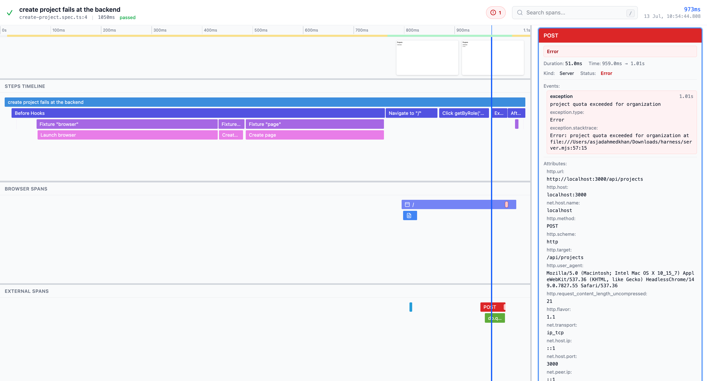
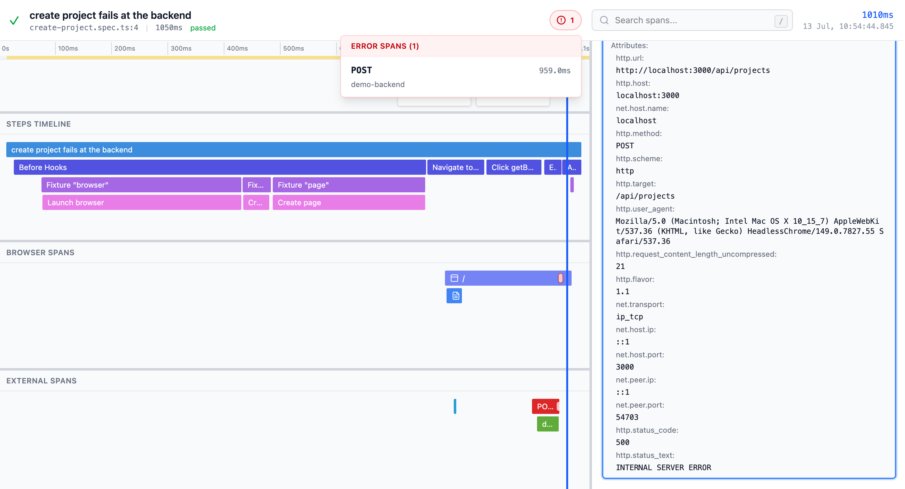
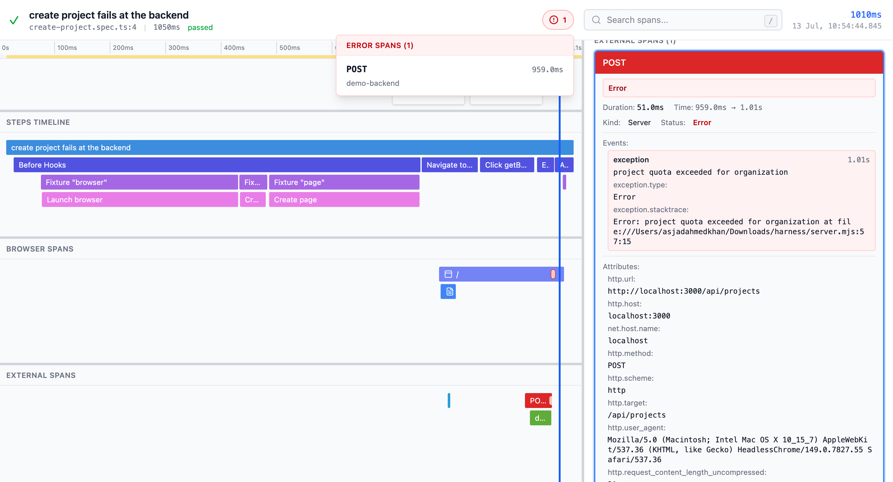

<p align="center">
	<picture>
		<source media="(prefers-color-scheme: dark)" srcset="docs/assets/logo-dark.svg" />
		
	</picture>
</p>

<h1 align="center">Playwright OpenTelemetry</h1>

<p align="center">
	<strong>Trace your Playwright tests across the entire stack.</strong>
</p>

<p align="center">
	<a href="https://www.npmjs.com/package/playwright-opentelemetry"></a>
	<a href="LICENSE"></a>
</p>

<p align="center">
	<a href="#quick-start">Quick start</a> ·
	<a href="#usage">Usage</a> ·
	<a href="https://trace.endform.dev">Hosted trace viewer</a> ·
	<a href="#contributing">Contributing</a>
</p>

---

`playwright-opentelemetry` records a Playwright test as OpenTelemetry spans, captures the browser activity around it, and propagates W3C trace context from browser requests into your instrumented backend. The result is one connected trace, shaped by a named test, that you can view alongside Playwright's screenshot filmstrip.



## Why

A failing end-to-end test can show you the click, the spinner, the outgoing network request, and a final screenshot of a page that never finished loading. Every one of those details is accurate, and not one of them tells you why the operation failed. The answer is usually beyond the network boundary, in an application handler, a failed queue consumer, or a database query that never ran. The browser only tells half the story.

The missing half becomes available the moment the test itself starts a distributed trace. Instead of the test ending at the browser, it becomes the root of a trace that reaches every instrumented service the user journey touched:

```text
Playwright test
    -> test step
        -> browser request + traceparent
            -> application request
                -> service call
                    -> database query
```

One trace ID runs the length of that chain. The failed test step is no longer an isolated screenshot, it is the top of a causal record you can read straight down into the backend. Because development and production run the same instrumentation, watching test traces during development also surfaces vague span names and missing attributes long before a production incident does.

## How it works

Three parts combine into a single test-shaped trace. Each part is optional, so you can adopt as much or as little as fits your setup.

| Package | What it does |
| --- | --- |
| [`playwright-opentelemetry`](reporter/) | A **reporter** that turns each retained test attempt into a root `playwright.test` span, with steps, hooks, fixtures, and actions as child spans. A **fixture** that records browser activity (navigations, requests, console messages, page errors) and injects a W3C `traceparent` header into browser requests so instrumented backends attach their spans beneath the test. |
| [`@playwright-opentelemetry/trace-viewer`](trace-viewer/) | A **trace viewer** designed around tests: a time-aligned flame graph with a screenshot filmstrip, split into test steps, browser spans, and external (backend) spans. Also [hosted at trace.endform.dev](https://trace.endform.dev). |
| [`@playwright-opentelemetry/trace-api`](trace-api/) | An **OTLP-compatible Trace API** that stores trace fragments in S3-compatible object storage and serves Playwright screenshots as a separate, manifest-backed artifact. Deployable to Cloudflare Workers, Deno, Bun, or Node.js. |

The fixture's reach stops at the browser. Every span deeper than that comes from your own services, continuing the context they received. Any service already running OpenTelemetry and honoring the `traceparent` header takes part automatically.



## Quick start

Install the package:

```bash
npm install --save-dev playwright-opentelemetry
```

Add the reporter and choose where the trace data goes in your Playwright config:

```ts
import { defineConfig } from "@playwright/test";
import type {
	PlaywrightOpentelemetryConfig,
	PlaywrightOpentelemetryUseOptions,
} from "playwright-opentelemetry/fixture";

const playwrightOpentelemetry: PlaywrightOpentelemetryConfig = {
	// Send to any OTLP destination, for example, Honeycomb.
	// You can also set the OTEL_EXPORTER_OTLP_ENDPOINT environment variable,
	// which takes precedence over this otlpEndpoint if both are set.
	otlpEndpoint: {
		url: "https://api.eu1.honeycomb.io/v1/traces",
		headers: {
			"x-honeycomb-team": "your-api-key",
		},
	},
	// Or write a local OpenTelemetry trace ZIP instead of, or alongside, OTLP.
	storeTraceZip: true,
};

export default defineConfig<PlaywrightOpentelemetryUseOptions>({
	reporter: [["playwright-opentelemetry/reporter"]],
	use: {
		playwrightOpentelemetry,
		// Screenshots come from Playwright's retained trace.
		trace: "retain-on-failure",
	},
});
```

Switch your tests to the instrumented fixture:

```ts
import { expect } from "@playwright/test";
import { test } from "playwright-opentelemetry/fixture";

test("has title", async ({ page }) => {
	await page.goto("https://playwright.dev/");

	await expect(page).toHaveTitle(/Playwright/);
});
```

Run your suite, then open the resulting trace ZIP in the [hosted viewer](https://trace.endform.dev), or boot the viewer locally:

```bash
npx @playwright-opentelemetry/trace-viewer
```

Two things set the boundary on what you will see. Connected backend spans require services that are already instrumented with OpenTelemetry and honor the propagated trace context. Screenshots depend on Playwright retaining a trace for the test, which follows your `use.trace` setting.

## Usage

Two things need to be set up for complete OpenTelemetry tracing:

1. A **reporter** that sends traces to your provider of choice
2. A **fixture** that propagates trace context to enable nested spans

### Configure the reporter

```ts
import { defineConfig, devices } from "@playwright/test";
import type {
	PlaywrightOpentelemetryConfig,
	PlaywrightOpentelemetryUseOptions,
} from "playwright-opentelemetry/fixture";

const playwrightOpentelemetry: PlaywrightOpentelemetryConfig = {
	// Or use environment variable OTEL_EXPORTER_OTLP_ENDPOINT
	otlpEndpoint: {
		url: "https://api.eu1.honeycomb.io/v1/traces",
		// Or use environment variable OTEL_EXPORTER_OTLP_HEADERS
		headers: {
			"x-honeycomb-team": "xxxabc",
		},
	},
	// Add more OTLP traces endpoints:
	// otlpEndpoints: [{ url: "https://collector-a.example.com/v1/traces", trace: "on" }],
	// Or output an opentelemetry report zip
	storeTraceZip: true,
	// Defaults to true. When enabled, browser requests receive a W3C
	// traceparent header that makes downstream spans children of the
	// Playwright-generated test trace. Export Playwright telemetry to the
	// same backend as your app telemetry to avoid missing root spans.
	propagateTraceHeaders: true,
	// Optional. Defaults to following Playwright's trace setting below.
	// trace: "on",
};

export default defineConfig<PlaywrightOpentelemetryUseOptions>({
	// ... other Playwright config
	reporter: [["playwright-opentelemetry/reporter"]],
	use: {
		playwrightOpentelemetry,
		// Playwright trace retention. OpenTelemetry output follows this unless
		// playwrightOpentelemetry.trace is configured above.
		trace: "retain-on-failure",
	},
	// ... rest of Playwright config
});
```

The current implementation sends OTLP/HTTP JSON payloads to configurable trace endpoints, so check that your destination accepts that transport before you wire it up.

### Configure the fixture

```ts
import { expect } from "@playwright/test";
import { test } from "playwright-opentelemetry/fixture";

test("has title", async ({ page }) => {
	await page.goto("https://playwright.dev/");

	await expect(page).toHaveTitle(/Playwright/);
});
```

### Add screenshots

Screenshots are reused from the trace Playwright already captured, rather than taken as a second independent stream. Configure Playwright's `trace` setting to control them:

```ts
import { defineConfig, devices } from "@playwright/test";
import type { PlaywrightOpentelemetryUseOptions } from "playwright-opentelemetry/fixture";

export default defineConfig<PlaywrightOpentelemetryUseOptions>({
	// ... other Playwright config
	use: {
		playwrightOpentelemetry: {
			storeTraceZip: true,
		},
		// Most performant method of screenshot collection
		trace: {
			mode: "on",
			screenshots: true,
			snapshots: false,
			sources: false,
			attachments: false,
		},
		// Otherwise this also does the trick!
		// trace: "on"
	},
	// ... rest of Playwright config
});
```

### Trace retention

By default, reporter output follows Playwright trace retention. If Playwright does not produce or retain a `trace` attachment for a test, `playwright-opentelemetry` will not send OTLP data, upload Trace API data, or write a local `*-pw-otel.zip` for that test.

Configure `use.trace` to control when Playwright traces and OpenTelemetry output are produced:

- `trace: "on"` exports every test.
- `trace: "retain-on-failure"` exports failed or unexpected tests.
- `trace: "on-first-retry"` exports first retries.
- `trace: "off"` exports nothing.

To control OpenTelemetry output independently, set `use.playwrightOpentelemetry.trace`. It accepts the same values as Playwright's `use.trace` and overrides Playwright's trace setting for both the fixture and reporter:

```ts
export default defineConfig<PlaywrightOpentelemetryUseOptions>({
	use: {
		playwrightOpentelemetry: {
			trace: "on",
		},
		trace: "retain-on-failure",
	},
});
```

You can also override trace retention for individual OpenTelemetry destinations. A destination-level `trace` setting overrides `use.playwrightOpentelemetry.trace` for that endpoint only. For example, you can keep local trace zips limited to failures while sending every test attempt to a specific OTLP backend:

```ts
export default defineConfig<PlaywrightOpentelemetryUseOptions>({
	use: {
		playwrightOpentelemetry: {
			trace: "retain-on-failure",
			storeTraceZip: true,
			otlpEndpoint: {
				url: "https://all-traces.example.com/v1/traces",
				trace: "on",
			},
		},
		trace: "retain-on-failure",
	},
});
```

Note: if a Playwright Trace API destination uses `trace: "on"` but Playwright uses `trace: "on-first-retry"` (or `off`), first-run spans still upload, but screenshots may be missing because Playwright did not write a trace file. `storeTraceZip` follows only the top-level trace setting.

### Viewing a trace

Go to the [hosted trace viewer](https://trace.endform.dev).

Or boot your own locally:

```bash
npx @playwright-opentelemetry/trace-viewer
```

This boots the trace viewer on `localhost:9294`. Then load your ZIP file or an API URL responding with telemetry.

The viewer separates the trace into three views that match how you investigate a failure:

- **Test steps** for the Playwright test, hooks, fixtures, and actions
- **Browser spans** for navigation, routes, JavaScript, fonts, images, fetches, and other requests
- **External spans** for your instrumented application and backend services

Console messages and uncaught browser errors appear as span events on the timeline, and the error navigator jumps straight to failing spans and their recorded exceptions.



### Using trace IDs in other reporters

Reporters configured after `playwright-opentelemetry/reporter` can read the trace ID from `TestResult.annotations` in `onTestEnd`:

```ts
const traceId = result.annotations.find(
	(annotation) => annotation.type === "playwrightOpentelemetryTraceId",
)?.description;
```

The annotation type is `playwrightOpentelemetryTraceId`. Its `description` is the 32-character OpenTelemetry trace ID, and it is only present when a trace was created for that test attempt.

## Output formats

### `opentelemetry-trace.zip` format

When `storeTraceZip: true` and Playwright retained a trace for the test, a local copy of trace data will be stored to your results folder with the format:

```
{file.spec}:{linenumber}-{testId}-pw-otel.zip
- traces/
  - playwright-opentelemetry.json <-- the OTLP request body of all trace data collected by the reporter related to this test. Test metadata is stored on the root `playwright.test` span.
- manifest.json <-- screenshot metadata with timestamps and ZIP paths
- screenshots/ <-- any screenshots collected during the test run
  - {page}@{pageId}-{timestamp}.jpeg
```

### Trace API

The trace viewer can also load traces from a trace-specific API base URL, for example `/playwright-otel-trace-viewer/v1/{traceId}`. That base URL must respond to the following endpoints:

- `GET {baseUrl}/traces` - merged OTLP trace export response
	- Response format `{ "resourceSpans": [...] }`
	- Returns `404` when the trace does not exist
- `GET {baseUrl}/screenshots.zip` - ZIP containing root `manifest.json` and `screenshots/*`, or `404` when there are no screenshots

The trace viewer derives base test information from the root `playwright.test` span attributes, including `test.case.title`, `playwright.test.describes`, `playwright.test.status`, `code.file.path`, and `code.line.number`.

### Deploying your own Trace API

The `@playwright-opentelemetry/trace-api` package provides a customizable H3-based library for storing and serving traces from S3-compatible storage. You can deploy it to Cloudflare Workers, Deno, Bun, Node.js, or any platform supporting web-standard Request/Response handlers.

See the [trace-api README](trace-api/README.md) for installation, usage examples, and deployment instructions.

## Project status

The project is in early development and still on a `0.x` release, so expect breaking changes between minor versions. The core workflow described above works today: test spans, browser spans, trace propagation, screenshot capture, OTLP export, local ZIPs, the Trace API, and the viewer.

The trace reaches only as far as your instrumentation does. The most useful thing you can tell us is where the trace still goes dark: [open an issue](https://github.com/endformdev/playwright-opentelemetry/issues).

## Contributing

See [CONTRIBUTING.md](CONTRIBUTING.md) for development setup, commands, and the release process.

## License

[Apache-2.0](LICENSE).

Playwright and OpenTelemetry are trademarks of their respective owners. This project is not affiliated with or endorsed by the Playwright or OpenTelemetry projects.

---

<p align="center">Built by</p>
<p align="center">
	<a href="https://endform.dev">
		<picture>
			<source media="(prefers-color-scheme: dark)" srcset="docs/assets/endform-logo-dark.svg" />
			
		</picture>
	</a>
</p>
